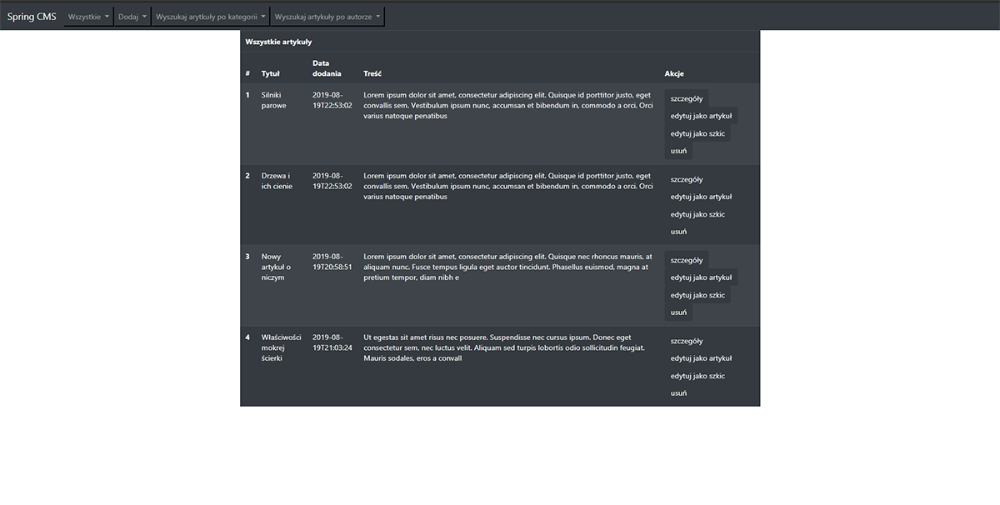
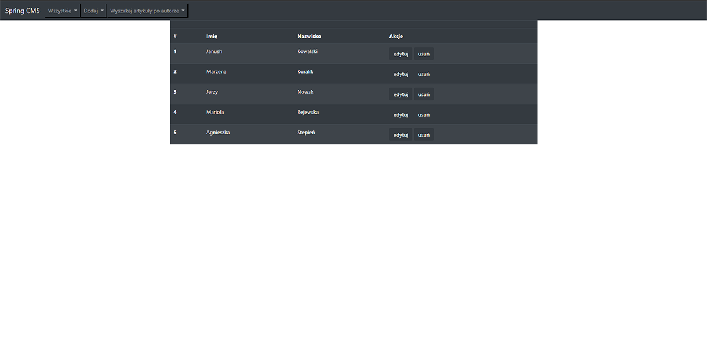
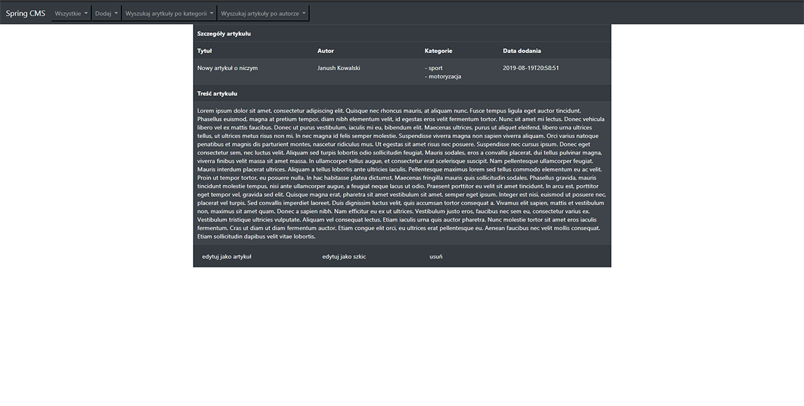
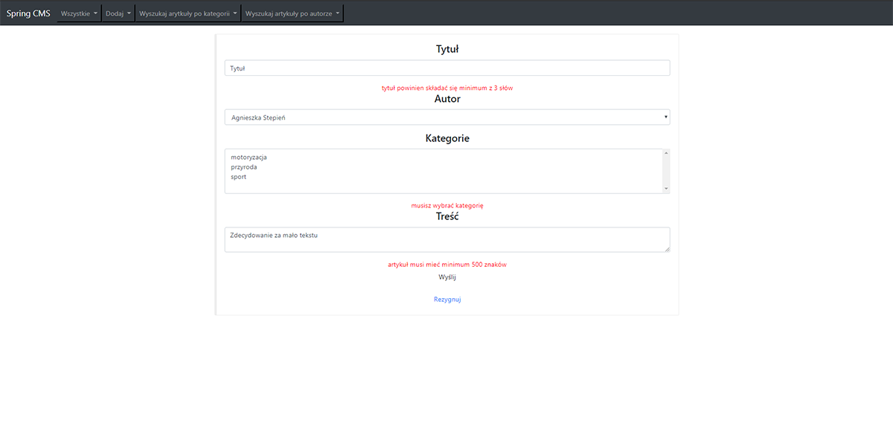

# Spring CMS
> Simple Spring MVC CMS Web application 

## Table of contents
* [General info](#general-info)
* [Screenshots](#screenshots)
* [Technologies](#technologies)
* [Features](#features)
* [Status](#status)

## General info
A small training project created to learn basic, annotation based Spring configuration for simple web application.
This project was a part of the CodersLab course.

## Screenshots
>all article page

>all authors page

>article details

>article form

## Technologies
* Spring framework - version - 5.1.6.RELEASE
* Spring Data Jpa - 2.1.8.RELEASE
* Hibernate - version - 5.4.2.Final
* Hibernate Validator - version - 6.0.13.Final
* Data Base - MySql - version 8.0.13
* Jstl - version - 1.2
* Bootstrap 4

## Features
* create / read / update / delete articles
* create / read / update / delete authors
* create / read / update / delete categories
* two stages of articles: draft and full article, both controlled by two separate validation groups

## Status
Project is no longer continued. It fulfilled it's purpose.